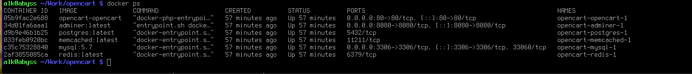
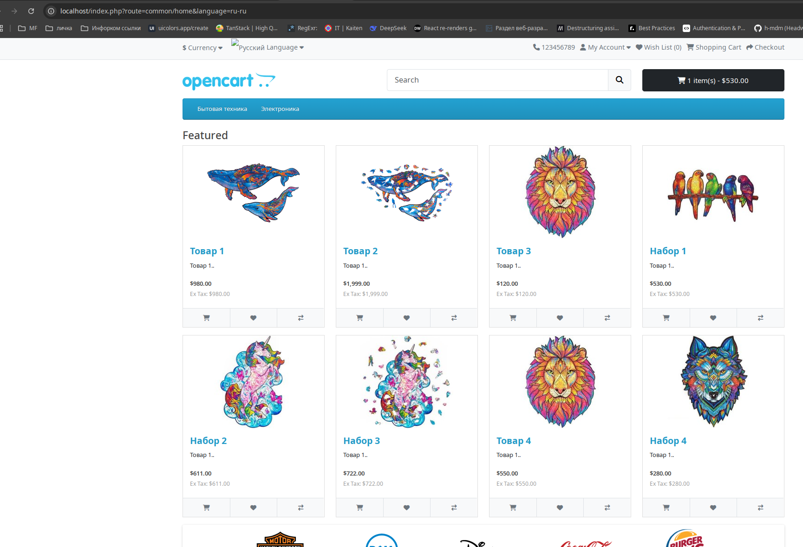
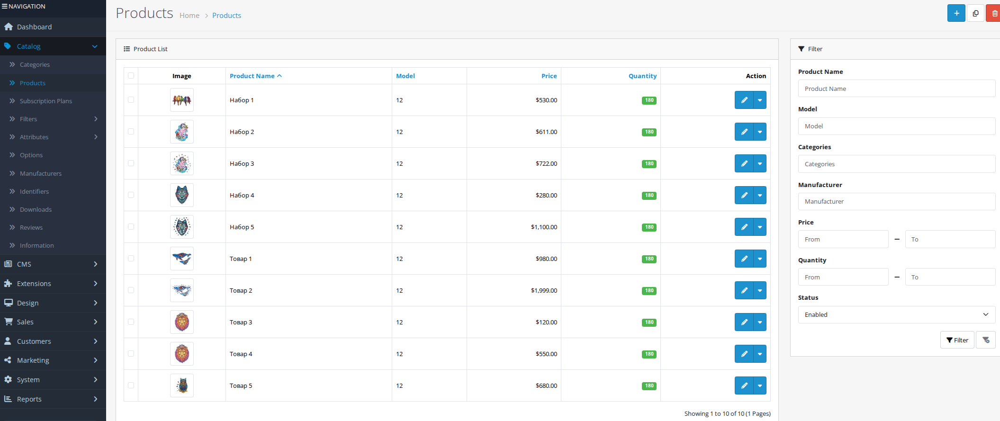
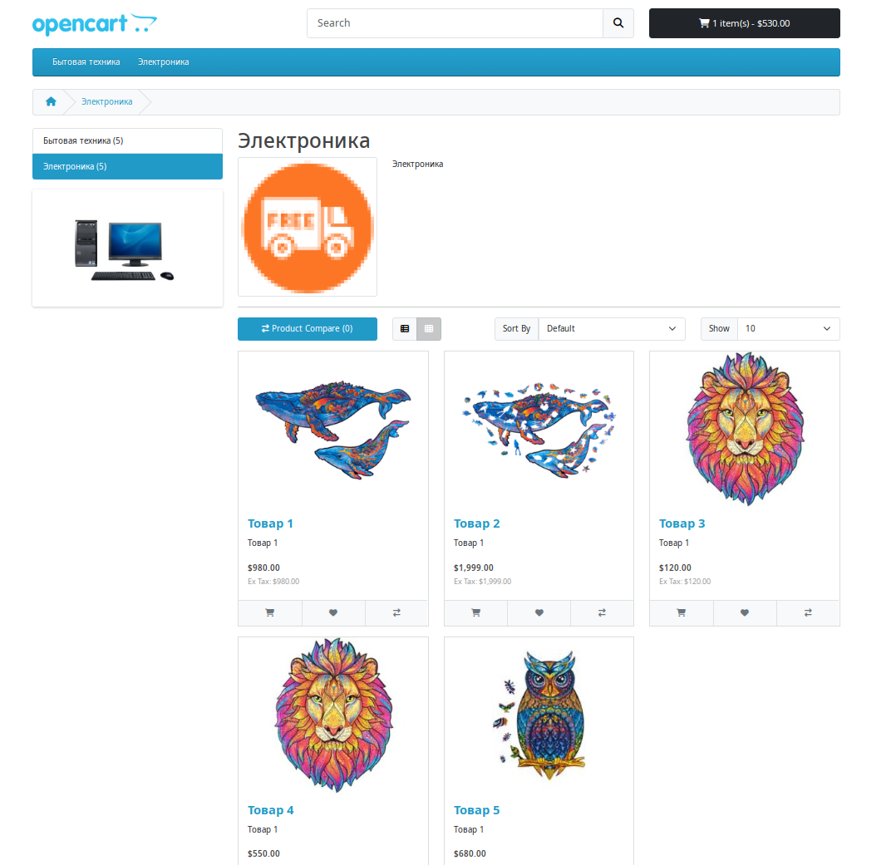
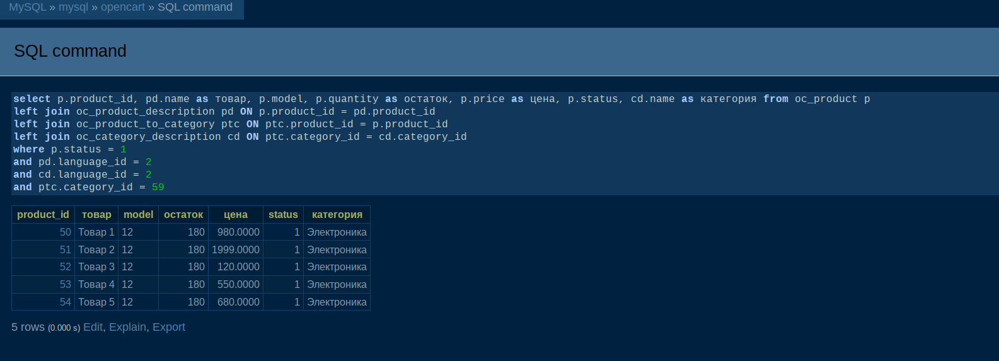
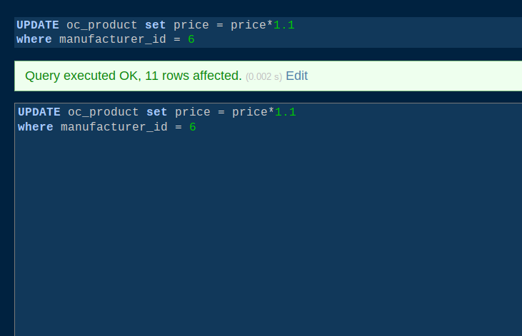
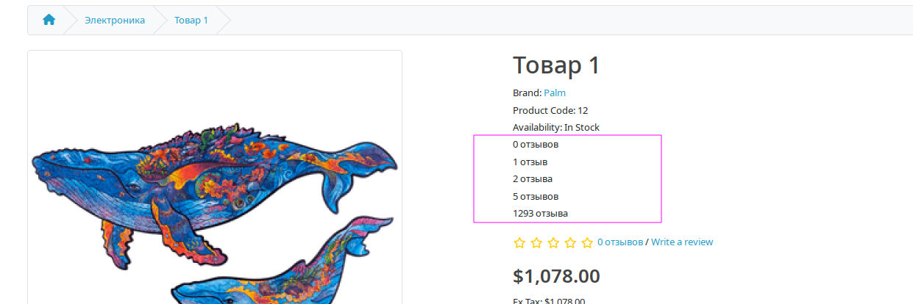
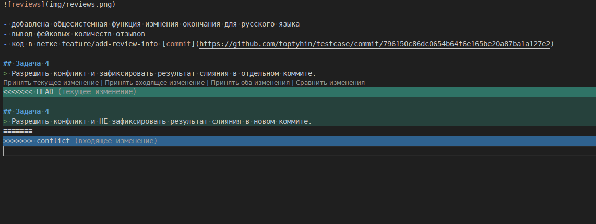
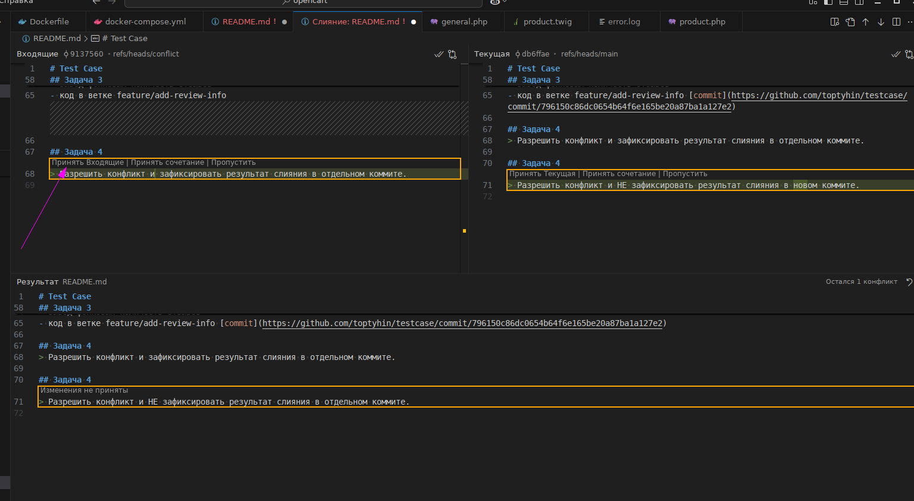
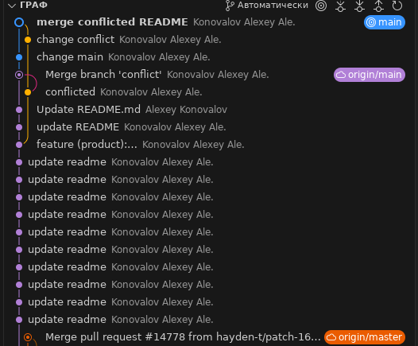

# Test Case

## Setup

1. Склонировать репозитарий перейти в директорию проекта
2. запустить 

`docker compose up --detach`

3. на выходе имеем 
апач на 80-м порту который отдает магазин опенкарта

на 8080 стоит adminer для работы с БД

+ memcached & redis & postgresql

### Список запущенных контейнеров

3. базовые настройки и пароли 

                 `cp config-dist.php config.php
                 cp admin/config-dist.php admin/config.php
                 php /var/www/html/install/cli_install.php install --username admin --password admin --email email@example.com --http_server http://localhost/ --db_driver mysqli --db_hostname mysql --db_username root --db_password opencart --db_database opencart --db_port 3306 --db_prefix oc_;`

4. Работа с кодом в дирректории upload
    она смонтирована как volume внутри контейнера /var/www/html
    изменения отображаются без перезапуска контейнера

### Скриншот главной страницы с товарами

### Скриншот админки с товарами

### Скриншот категории с товарами

### Скриншот sql
>  Напишите SQL-запрос для получения списка всех товаров из категории "Электроника" с их ценами и количеством на складе.

>  Напишите SQL-запрос для изменения цены всех товаров определенного
производителя (например, увеличьте цену на 10%).

## Задача 3
> Вывод дополнительного поля «Количество отзывов».

- добавлена общесистемная функция измнения окончания для русского языка
- вывод фейковых количеств отзывов
- код в ветке feature/add-review-info [commit](https://github.com/toptyhin/testcase/commit/796150c86dc0654b64f6e165be20a87ba1a127e2)

## Задача 4
> Разрешить конфликт и зафиксировать результат слияния в отдельном коммите.

>Краткое описание подхода к разрешению конфликта слияния, включая пояснения по выполненным шагам

Ветка main - эталон, изменения в ней важнее входящих, .... но есть ньюансы. Решать каждый раз мейнтейнеру.

>Вывод команды git log (или иной отчет, демонстрирующий все проведенные операции).
